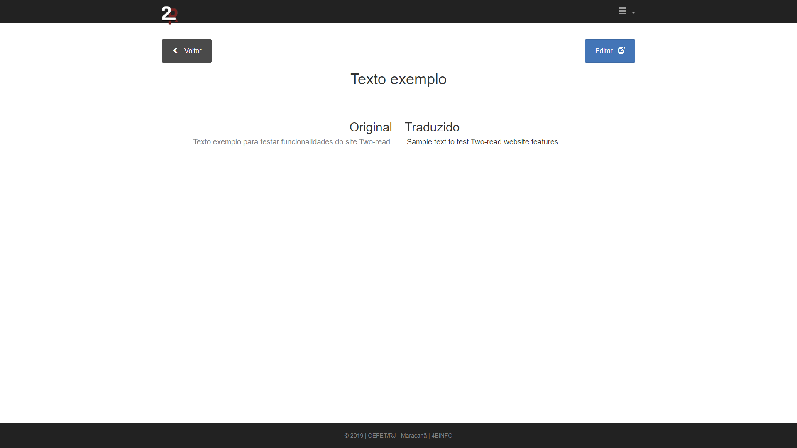

# Sobre

Site desenvolvido para meu projeto final do ensino médio/técnico de informática do CEFET. Este que, possui a finalidade de aprender outros idiomas através da leitura e contexto.

## Página inicial

## Login e cadastro

## Textos do usuário

## Texto exemplo

## Configurações

# Como usar

Por ainda estar em desenvolvimento é necessário modificar algumas variáveis no arquivo two-read/lib/config.php, mais precisamente o 'APP_PREFIX'  .
Como ainda não está em nenhum servidor online, é precisso ter algum servidor web local, pois é feio em PHP.

# Links amigos

<ul>
  <li>https://github.com/jstewmc/rtf
  <li>https://github.com/spatie/pdf-to-text
  <li>https://github.com/statickidz/php-google-translate-free
<ul/>
